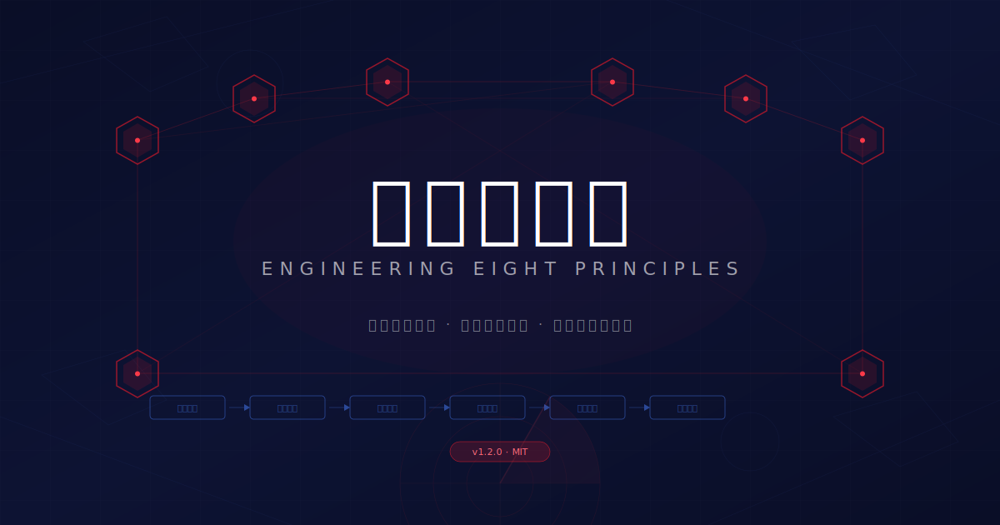

<p align="center">
  
</p>

<p align="center">
  <a href="https://github.com"></a>
  <a href="https://docs.qoder.com/qoderwork/introduction"></a>
  <a href="./LICENSE"></a>
</p>

---

## 概述

工程八原则是一套结构化的软件项目全生命周期方法论，覆盖从立项到上线的完整过程。它提供八大指导原则和六阶段生命周期，每个阶段都有明确的入口条件、核心动作和出口门禁。

本方法论面向 3 人以上、工期 2 个月以上的团队设计，同时为小团队和短周期项目提供精简路径。

### 适用人群

技术负责人、项目经理、以及通过 QoderWork 使用 AI 辅助的工程团队——凡是需要一套有纪律的项目规划、诊断评估、迭代管理和上线就绪框架的人。

---

## 八大原则

| # | 代号 | 工程含义 | 一句话 |
|---|------|---------|--------|
| 1 | **三八线** | 服务间必须有清晰的接口契约和隔离边界 | 服务之间划"分界线"——清晰的契约，各自独立演进 |
| 2 | **侧翼登陆** | 找到改变项目全局走向的杠杆点 | 找到那个翻转全局的技术决策，集中资源打穿 |
| 3 | **长津湖** | 极端约束下，集中力量攻克关键模块 | 选完切入点后，把优势资源集中在最关键的局部 |
| 4 | **反绞杀** | 核心链路多路冗余：熔断、降级、自动恢复 | 核心管线必须有多路备份——熔断、降级、自愈 |
| 5 | **上甘岭** | 质量基线寸步不让：SLA、性能、安全 | SLA、性能基线、安全标准——丢了就输了 |
| 6 | **边打边谈** | 保持迭代节奏，用交付成果推动需求收敛 | 不等需求完美再动手，迭代交付就是最好的需求协商 |
| 7 | **金城** | 上线前压测和应急预案——临门一脚决定成败 | 上线前的全链路压测和应急预案，值得投入 50% 的精力 |
| 8 | **代价意识** | 每个技术决策都有隐性成本，要让它们可见 | 被砍功能、被边缘化的成员、被牺牲的探索——都要看见 |

---

## 六阶段生命周期

```mermaid
flowchart LR
    P0["<b>阶段 0 · 立项研判</b><br/>Inception"]
    P1["<b>阶段 1 · 迭代冲刺</b><br/>Sprint"]
    P2["<b>阶段 2 · 韧性加固</b><br/>Resilience"]
    P3["<b>阶段 3 · 质量收敛</b><br/>Quality"]
    P4["<b>阶段 4 · 持续交付</b><br/>Delivery"]
    P5["<b>阶段 5 · 上线收尾</b><br/>Launch"]

    P0 -- "底线目标明确<br/>核心团队就位" --> P1
    P1 -- "集成测试通过<br/>性能基线建立" --> P2
    P2 -- "单点故障消除<br/>故障演练通过" --> P3
    P3 -- "质量基线达标<br/>安全审计通过" --> P4
    P4 -- "版本范围确认<br/>需求冻结" --> P5

    P4 -. "新版本迭代" .-> P1

    style P0 fill:#e3f2fd,stroke:#1976d2,stroke-width:2px,color:#0d47a1
    style P1 fill:#e8f5e9,stroke:#388e3c,stroke-width:2px,color:#1b5e20
    style P2 fill:#fff3e0,stroke:#f57c00,stroke-width:2px,color:#e65100
    style P3 fill:#fce4ec,stroke:#d32f2f,stroke-width:2px,color:#b71c1c
    style P4 fill:#f3e5f5,stroke:#7b1fa2,stroke-width:2px,color:#4a148c
    style P5 fill:#e0f2f1,stroke:#00897b,stroke-width:2px,color:#004d40
```



每个阶段都有严格的**入口条件**、**核心动作**和**出口门禁**。阶段不可跳过，但可以合并（小团队）或回退（条件变化时）。阶段 4 与阶段 1 之间可以循环——当产品进入下一版本迭代时，从持续交付回到迭代冲刺。详细操作指南见 [`phases.md`](./phases.md)。

### 按团队规模的精简路径

| 团队规模 | 建议路径 |
|---------|----------|
| 5 人以上 | 六阶段全流程 |
| 3-5 人 | 合并阶段 2+3，合并阶段 4+5 |
| 2-3 人 | 只用原则 1+5+6，跳过正式阶段流程 |
| 单人 / 不足 2 周 | 方法论成本超过项目本身——不推荐 |

---

## 文件结构

```
engineering-eight-principles/
├── SKILL.md                        # 核心技能定义（v1.2.0）
├── phases.md                       # 六阶段操作手册
├── assessment-template.md          # 项目诊断报告模板
├── campaign-template.md            # 阶段执行方案模板
├── dashboard-template.html         # HTML 诊断仪表盘
├── example-payment-platform.md     # 示例：支付中台 v2.0 迁移
├── example-diagnostic-report.md    # 示例：后台重构诊断报告
├── hero-banner.svg                 # 宣传图
├── korean-war-comprehensive-guide.md # 朝鲜战争参考资料
├── README.md                       # 本文件
└── LICENSE
```

### 各文件说明

**SKILL.md** 是方法论核心文档。它定义了八大原则、六阶段、四种使用模式、决策框架和反模式清单。作为 QoderWork 技能安装时，这是 Agent 读取的主文件。

**phases.md** 是每个生命周期阶段的详细操作手册，包含入口条件、分步核心动作、出口门禁和阶段转换规则。

**assessment-template.md** 是项目诊断报告的结构化模板，覆盖六个章节：总体诊断、八原则逐项扫描、阶段评估、风险矩阵、行动建议和下次评估计划。

**campaign-template.md** 是阶段执行方案模板，结构化呈现项目现状、杠杆点、分阶段计划、风险预案和里程碑总览。

**dashboard-template.html** 是自包含的 HTML 诊断仪表盘。渲染雷达图（Canvas）、阶段进度条、原则健康卡片、风险发现和行动项。通过 `window.__EIGHT_PRINCIPLES_DATA__` 注入数据。支持 oklch 色彩空间（含 rgba 回退）、XSS 安全渲染和无障碍访问。

**example-payment-platform.md** 演示了一个支付中台 v2.0 迁移的完整阶段执行方案（5 人团队，4 个月工期）。

**example-diagnostic-report.md** 演示了一份游戏配置后台重构的完整诊断报告，包含八原则扫描和风险矩阵。

**hero-banner.svg** 仓库宣传图，SVG 矢量格式，可在 GitHub 上直接渲染。

**korean-war-comprehensive-guide.md** 朝鲜战争全面资料汇编——本方法论的历史灵感来源。

---

## 使用模式

本方法论支持四种交互模式，根据用户需求选择：

| 模式 | 触发方式 | 输出产物 |
|------|---------|----------|
| **现状诊断** | "帮我看看这个项目" / "项目健康度" | Markdown 诊断报告 |
| **阶段规划** | "帮我规划这个项目" / "执行方案" | Markdown 执行方案 |
| **项目仪表盘** | "给我全局视图" / "项目状态" | HTML 诊断报告 |
| **阶段导航** | "下一步该做什么" / "下一阶段" | 阶段评估 + 行动建议 |

### 快速开始

首次使用时，回答三个问题：

1. **项目是新立项还是进行中？** — 新立项从阶段 0 开始，进行中先做现状诊断。
2. **你需要什么？** — 诊断、规划、可视化还是导航。
3. **当前最大痛点是什么？** — 用于优先扫描相关原则。

---

## 安装

### QoderWork 安装

将整个目录复制到 QoderWork 技能目录：

```bash
cp -R engineering-eight-principles/ ~/.qoderwork/skills/engineering-eight-principles/
```

安装后即可在 QoderWork 中使用。触发关键词："工程八原则"、"engineering-eight-principles"、"项目诊断"、"执行方案"、"阶段规划"等。

### 独立使用

所有文件均为纯 Markdown（加一个 HTML 模板）。可以直接阅读，也可以将模板复制到自己的项目文档中，或集成到其他 AI 助手工作流。

---

## 数据契约（仪表盘模板）

HTML 仪表盘模板通过全局 JavaScript 变量接收数据：

```javascript
window.__EIGHT_PRINCIPLES_DATA__ = {
  projectName: "我的项目",
  overallScore: 72,           // 0-100
  overallStatus: "warn",      // ok | warn | alert
  currentPhase: 2,            // 0-indexed（显示为阶段 3）
  phases: [
    { name: "立项研判", status: "completed" },
    { name: "迭代冲刺", status: "completed" },
    { name: "韧性加固", status: "current" },
    { name: "质量收敛", status: "pending" },
    { name: "持续交付", status: "pending" },
    { name: "上线收尾", status: "pending" }
  ],
  principles: [
    { name: "架构边界", score: 85, status: "ok" },
    { name: "杠杆点",   score: 70, status: "warn" },
    // ... 全部 8 个原则
  ],
  metrics: [
    { label: "迭代速度", value: "85%", trend: "up" },
    // ...
  ],
  risks: [
    { severity: "critical", title: "...", description: "...", mitigation: "..." },
    // ...
  ],
  actions: [
    { priority: "high", owner: "...", deadline: "...", task: "..." },
    // ...
  ]
};
```

**评分阈值：** `score >= 75` → ok（绿色），`55-74` → warn（黄色），`< 55` → alert（红色）。

缺失字段自动回退到内置默认值——模板不会渲染 `undefined`。

---

## 关键决策框架

方法论内含三个可复用的决策框架：

**架构边界划定法**（用于架构决策）：识别利益相关方 → 划清分界线 → 建立接口契约 → 各自独立演进。

**杠杆点识别法**（当项目陷入僵局时）：当前方案成本几何？→ 有没有被忽视的替代方案？→ 一旦选定，集中资源打穿。

**需求协商协议**（当需求不断变化时）：保持每 2 周交付 → 用已交付成果作为协商依据 → 需求分为冻结 / 待协商 / 灵活三级。

---

## 反模式清单

| 反模式 | 后果 |
|--------|------|
| 范围蔓延 | 需求无限扩张，核心目标失焦 |
| 资源堆砌陷阱 | 加人不等于解决问题，需要方法 |
| 单点故障级联 | 关键链路无冗余 → 全链路瘫痪 |
| 上线前需求突袭 | 即将交付时插入大量变更，打乱全部节奏 |
| 复盘缺失 | 经验白白流失，下个项目重蹈覆辙 |

---

## 示例

本仓库包含两个完整示例：

**支付中台 v2.0 迁移**（[`example-payment-platform.md`](./example-payment-platform.md)）——5 人团队，4 个月工期，演示完整的六阶段执行方案和风险预案。

**后台重构诊断报告**（[`example-diagnostic-report.md`](./example-diagnostic-report.md)）——游戏配置后台重构项目，处于阶段 3（质量收敛），演示八原则逐项扫描、风险矩阵和行动建议。

---

## 设计原则

方法论及其模板遵循以下设计约束：

- **纯工程术语** ——交付物中不使用军事术语，代号仅作为内部引用。
- **编辑级排版** ——诊断报告采用衬线标题 + 无衬线正文 + 等宽数据，参照专业工程审查风格。
- **无障碍访问** ——HTML 模板包含 ARIA 角色、标签和 `prefers-reduced-motion` 支持。
- **oklch 色彩系统** ——含自动 rgba 回退，兼容不支持 oklch 的环境。
- **XSS 安全** ——所有用户提供的字符串在 DOM 插入前进行转义。

---

## 贡献

欢迎贡献。如果你在实际项目中使用了本方法论，有反馈、改进或新的示例，请提交 Issue 或 Pull Request。

---

## 许可证

MIT
